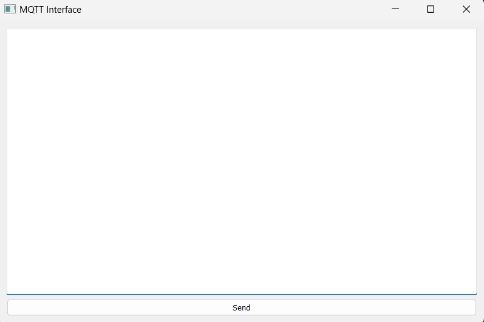
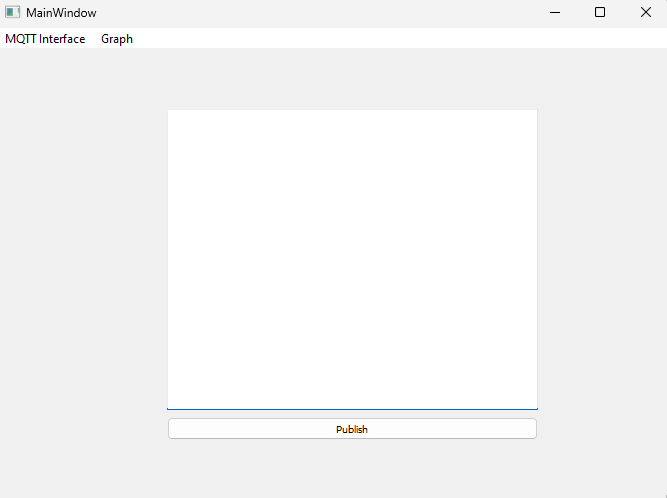

# MQTT Interface
 Python application that can send and receive data to/from an MQTT broker.

 ## Getting Started
 Clone the repository, activate the virtual environment and install all dependencies: 
 ``` 
 git clone https://github.com/nihalsuri/MQTT-Interface.git
 python3 -m venv venv
 call venv\Scripts\activate.bat
 pip install PyQt5
``` 
Make sure to also add your own "Simulated_sensor_data.csv" file to the root of the project so that there is something to publish on the broker, if the name of the file is something different please updated the ".gitignore" file as well to keep the sensor data private and not upload it to the remote
## Functionality & Debugging
The application acts as an interface to publish data on the broker on a specific topic and view what the subscription on the same topic provides as an end result. The application can be broken down into the following: 
### Main UI
The main UI used was created using PyQt5, as this was a very basic UI: 


 the method to use QtDesigner would be a bit "overkill" according to me, but still as its quite an user friendly application an approach was also conducted with the same and can be found under **"ui/standard_interface.ui"** and it looks like so: 



### MQTT Logic
Two seperate classes were created one for publishing to the topic on the broker and the other to subscribe to the topic and then display whatever the subscription listened too. The broker used for our purpose was [ Eclipse Mosquitto](https://test.mosquitto.org/) as its a free easy to use cloud based service, other options similar to the same is [Hive MQ](https://www.hivemq.com/) or to install a broker service locally on your PC and run the same, but for our purposes using an online broker is sufficient. The port we use for listening purposes is **1883** as its without any encryption or certificates, if security would be more of a priority here then another port could be utlizied. Actual working of the application can be seen below: 


### Sensor Data Reading: 
Every row is read one by one of the sensor data file, whenever a publish command is sent out the next row is read and converted from a dictionary to a JSON string untill the file has reached its end. The logic for the same can be observed on the **load_csv_data** function in the **main.py** script. 


## Design Decisions 
- Code developed using OOP approach with segregation for logic as seen fit
- Usage of a **venv** for flexible, cleaner usage of packages and Python versions
- PEP8 standards of documentation
  - Methods should be lowercase with words separated with underscores
  - 79 character limit per line
  - Docstrings for functions to clearly define their purpose
  - Proper indentation and alignment for inline comments
- Comments added where and when necessary
- Industry standard version control practices respected
    - Clean commits with useful messages allowing clarity for future contribution to the project by other developers
- Tracking pain points throughout the application cycle so that other developers can be aware as well  


## Recommendations to the main task
- Clear decleration in the task of versions of PyQt and Python to be used 
- To clarify that to use PyQt you also must have Microsoft C++ Build Tools (as Qt is developed in C++) installed which is almost 7 GB 


## Future Improvements
- Add traces and graphs across time to the UI - with flexibility to choose the exact timestamps. Flexible libraries like **matplotlib** can be used for the same. 